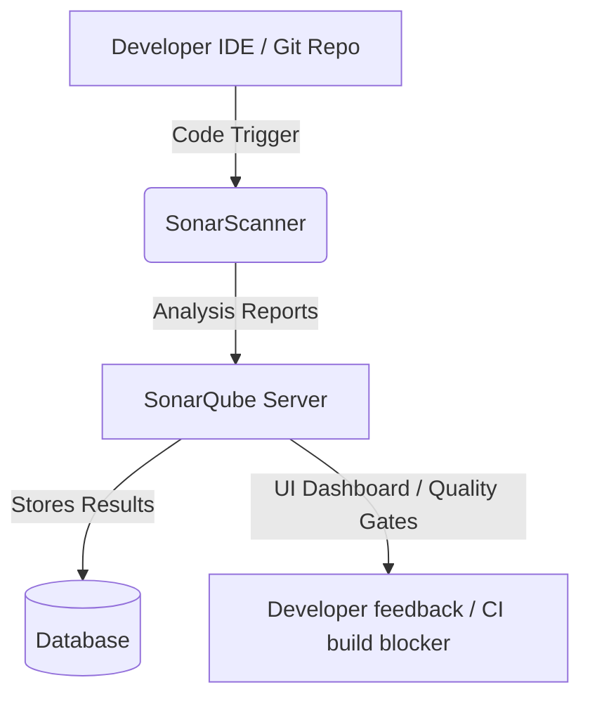

# Introduction to SonarQube

## What is SonarQube?
SonarQube is an open-source platform developed by SonarSource for continuous inspection of code quality. It performs automatic reviews with static analysis of code to detect bugs, code smells, and security vulnerabilities in over 30 programming languages (including Java, C#, JavaScript, Python, C/C++, etc.).

It acts as a gatekeeper in the software development lifecycle (SDLC), ensuring that only clean, secure, and maintainable code is merged and deployed to production.

---

## Why is SonarQube Used?
Modern software engineering emphasizes **Continuous Integration and Continuous Deployment (CI/CD)**. SonarQube fits perfectly into this flow by:
1. **Ensuring Code Quality:** Automatically scans code to identify bugs and logic errors before they reach production.
2. **Identifying Security Vulnerabilities:** Checks for security flaws (like OWASP Top 10 vulnerabilities, SQL injection, cross-site scripting) to prevent security breaches.
3. **Reducing Technical Debt:** Highlights "code smells" (confusing code, duplicated code, overly complex methods) and estimates the time/effort required to fix them.
4. **Enforcing Standards:** Standardizes style rules, formatting guidelines, and architectural rules across a team or organization.
5. **Measuring Code Coverage:** Integrates with unit testing tools (like JUnit, JaCoCo) to show which lines of code are covered by tests and which are not.

---

## Core Concepts & Key Features

### 1. The Quality Gate
A **Quality Gate** is a set of boolean conditions that a project must meet before it can be released. It answers the simple question: *"Is our project clean and safe to merge/release?"*
- If a project meets the criteria (e.g., 0 critical bugs, >80% test coverage, 0 new vulnerabilities), it **Passes**.
- If it fails any condition, it **Fails**, warning developers and potentially blocking the build pipeline.

### 2. Clean Code Taxonomy
SonarQube categorizes issues into:
- **Bugs:** Coding errors that will break the code or cause runtime failures (e.g., NullPointerExceptions, infinite loops).
- **Vulnerabilities:** Security holes that can be exploited by attackers.
- **Code Smells:** Maintainability issues that make the code harder to read, modify, or scale (e.g., unused variables, high cognitive complexity).
- **Security Hotspots:** Suspicious code areas that need manual review (e.g., hardcoded passwords, insecure encryption algorithms).

### 3. Reliability, Security, and Maintainability Ratings
SonarQube scores code on a scale of **A (best) to E (worst)** based on the severity of outstanding issues:
- **Reliability:** Grade A if there are no bugs.
- **Security:** Grade A if there are no vulnerabilities.
- **Maintainability:** Calculated based on the ratio of technical debt to the total time spent developing the project.

---

## How SonarQube Works

The SonarQube ecosystem consists of three main components:


1. **SonarScanner:** A command-line client or plugin (running locally or in a build server like Jenkins, GitHub Actions) that parses the source files, runs the analysis, and generates a report.
2. **SonarQube Server:** A central server that parses the reports, runs calculations, evaluates Quality Gates, and serves the web UI.
3. **Database:** Stores the code analysis history, settings, metrics, and quality ratings (PostgreSQL, MS SQL, or Oracle).

---

## Integrating SonarQube with a Maven Project

Integrating SonarQube with a Java/Maven project is extremely straightforward. 

### Step 1: Add SonarQube Plugin to `pom.xml`
You can declare the `sonar-maven-plugin` in your build plugin management:
```xml
<build>
    <plugins>
        <plugin>
            <groupId>org.sonarsource.scanner.maven</groupId>
            <artifactId>sonar-maven-plugin</artifactId>
            <version>3.10.0.2594</version>
        </plugin>
    </plugins>
</build>
```

### Step 2: Configure Sonar Properties
You can specify properties directly in `pom.xml` or pass them via command line:
```xml
<properties>
    <sonar.host.url>http://localhost:9000</sonar.host.url>
    <sonar.token>your-sonarqube-generated-token</sonar.token>
    <sonar.java.binaries>target/classes</sonar.java.binaries>
</properties>
```

### Step 3: Run the Analysis
To scan the project, simply build it and trigger the sonar goal:
```bash
mvn clean verify sonar:sonar
```
Once execution finishes, you can navigate to `http://localhost:9000` to view the comprehensive dashboard for your project.
